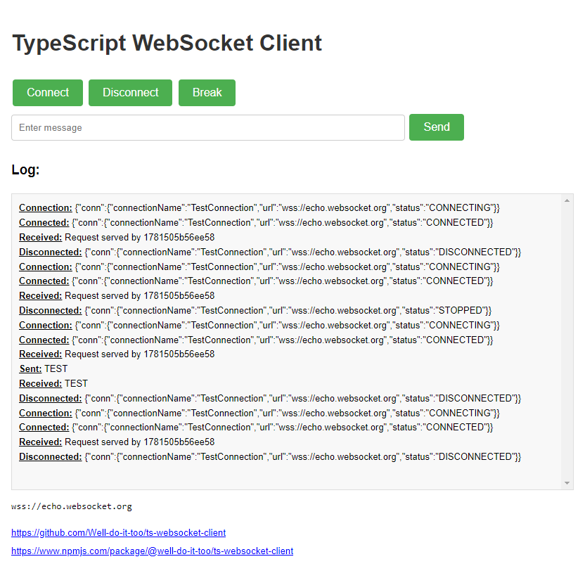

[](http://copyfree.org)


# TypeScript WebSocket Client

A robust and flexible WebSocket client implementation in TypeScript, designed for use in React, Node.js, and web projects.
Based on https://github.com/Well-do-it-too/ts-universal-package



- [Demo](https://well-do-it-too.github.io/ts-websocket-client/)

## Features

- Easy-to-use WebSocket client implementation
- Automatic reconnection with exponential backoff
- Event-based architecture for easy integration
- TypeScript support for better developer experience
- Compatible with React, Node.js, and web projects
- Customizable logging and debugging options

## Installation

```bash
npm install @well-do-it-too/ts-websocket-client
```

or

```bash
yarn add @well-do-it-too/ts-websocket-client
```

## Usage

### Basic Example

Here's a basic example of how to use the WebSocket client:

```typescript
import { WebSocketClient } from '@well-do-it-too/ts-websocket-client';

const client = new WebSocketClient({
  connectionName: 'MyConnection',
  url: 'wss://echo.websocket.org',
  debugging: true,
  onOpened: (info) => console.log('Connected:', info),
  onClosed: (info) => console.log('Disconnected:', info),
  onError: (info) => console.error('Error:', info),
  onUpdate: (info) => console.log('Received:', info.data),
});

client.open();

// Send a message
client.sendMessage('Hello, WebSocket!');

// Close the connection
client.close();
```

### Node.js Example

Here's an example of how to use the WebSocket client in a Node.js environment:

```typescript
import { WebSocketClient } from '@well-do-it-too/ts-websocket-client';

const client = new WebSocketClient({
  connectionName: 'NodeConnection',
  url: 'wss://echo.websocket.org',
  debugging: true,
  onOpened: (info) => {
    console.log('Connected:', info);
    // Send a message every 5 seconds
    setInterval(() => {
      client.sendMessage('Ping from Node.js');
    }, 5000);
  },
  onClosed: (info) => console.log('Disconnected:', info),
  onError: (info) => console.error('Error:', info),
  onUpdate: (info) => console.log('Received:', info.data),
});

client.open();

// Handle process termination
process.on('SIGINT', () => {
  console.log('Closing connection...');
  client.close();
  process.exit();
});
```

### React Example

Here's an example of how to use the WebSocket client in a React component:

```tsx
import React, { useEffect, useState } from 'react';
import { WebSocketClient } from '@well-do-it-too/ts-websocket-client';

const WebSocketComponent: React.FC = () => {
  const [client, setClient] = useState<WebSocketClient | null>(null);
  const [messages, setMessages] = useState<string[]>([]);

  useEffect(() => {
    const wsClient = new WebSocketClient({
      connectionName: 'ReactConnection',
      url: 'wss://echo.websocket.org',
      debugging: true,
      onOpened: (info) => console.log('Connected:', info),
      onClosed: (info) => console.log('Disconnected:', info),
      onError: (info) => console.error('Error:', info),
      onUpdate: (info) => {
        setMessages((prevMessages) => [...prevMessages, info.data as string]);
      },
    });

    setClient(wsClient);
    wsClient.open();

    return () => {
      wsClient.close();
    };
  }, []);

  const sendMessage = () => {
    if (client) {
      client.sendMessage('Hello from React!');
    }
  };

  return (
    <div>
      <button onClick={sendMessage}>Send Message</button>
      <ul>
        {messages.map((message, index) => (
          <li key={index}>{message}</li>
        ))}
      </ul>
    </div>
  );
};

export default WebSocketComponent;
```

## API

### `WebSocketClient`

The main class for creating and managing WebSocket connections.

#### Constructor

```typescript
new WebSocketClient(options: WebSocketOptions)
```

- `options`: Configuration options for the WebSocket client

#### Methods

- `open()`: Opens the WebSocket connection
- `close()`: Closes the WebSocket connection
- `breakConnection()`: Forcibly breaks the connection
- `sendMessage(data: string)`: Sends a message through the WebSocket
- `subscribe(data: string)`: Subscribes to a topic (stores the request)
- `unsubscribe(data: string)`: Unsubscribes from a topic
- `getInfo()`: Returns current connection information
- `getStoredRequests()`: Returns the set of stored requests
- `clearStoredRequests()`: Clears all stored requests

## Development

To set up the development environment:

1. Clone the repository
2. Install dependencies: `npm install` or `yarn install`
3. Run tests: `npm test` or `yarn test`
4. Build the package: `npm run build` or `yarn build`

## Contributing

Contributions are welcome! Please feel free to submit a Pull Request.

## License

This project is licensed under the ISC License.

## Links

- [GitHub Repository](https://github.com/Well-do-it-too/ts-websocket-client)
- [npm Package](https://www.npmjs.com/package/@well-do-it-too/ts-websocket-client)
- [Demo](https://well-do-it-too.github.io/ts-websocket-client/)

---

Developed with ❤️ by [Well-do-it-too](https://github.com/Well-do-it-too)
